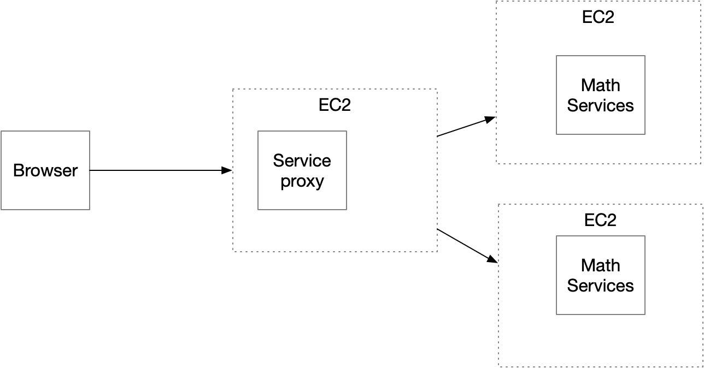
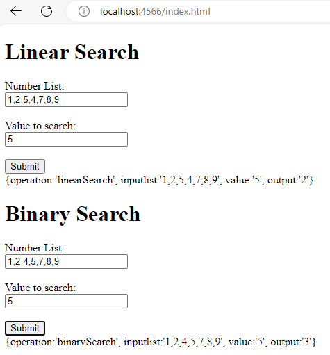
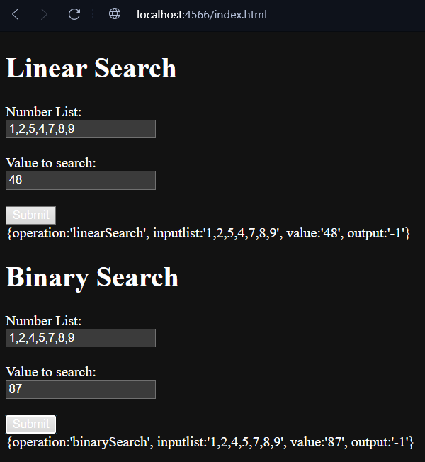

# AREP-Parcial-2

### Arquitectura

Este proyecto cuenta con la siguiente arquitectura en la nube:

Donde cada uno de los elementos cumple las siguientes funciones:

#### Service Proxy

Recibe las solicitudes de llamado desde los clientes y se las delega a las dos instancias del servicio de ordenamiento
usando un algoritmo de round-robin, también es quien le da el acceso a la página que usará el cliente.

#### Math Services

Este servicio recibe peticiones con los datos ``(lista, valor)``, done implementa dos algoritmos de búsqueda diferentes,
Linear search y binary search, donde el primero realiza la búsqueda dato por dato dentro de la lista hasta encontrar él
dato solicitado, este método no es muy eficiente para listas muy grandes, pues en el peor de los casos la tiene que recorrer
toda, por el contrario, el segundo método, como obtiene los elementos ya ordenados, este va dividiendo la lista en dos
partes y compara en cuál de los dos rangos puede estar el número a buscar, por lo que en cada iteración se va descartando
la mitad de los datos restantes hasta encontrar al buscado o devolver -1 en caso de no encontrarlo.

### Como ejecutar (Local)

Clonamos el repositorio:
~~~
git clonehttps://github.com/JordyBautista10/AREP-Parcial-2.git
~~~

Se entra a la carpeta
~~~
cd AREP-Parcial-2
~~~

Se descargan las dependencias
~~~
mvn clean install
~~~

Se crean las variables de entorno:
~~~
set SERVER_1="http://localhost:4567/"
set SERVER_2="http://localhost:4567/"
~~~

Ahora sí se pueden correr los servicios:
~~~
java -cp "target/classes;target/dependency/*" co.edu.escuelaing.ServiceProxy
~~~
~~~
java -cp "target/classes;target/dependency/*" co.edu.escuelaing.MathServices
~~~

### Como ejecutar (Nube)
Se descargan las herramientas necesarias:
~~~
sudo yum install maven
~~~
~~~
sudo yum install git
~~~
~~~
sudo yum install java-17-amazon-corretto.x86_64
~~~

Clonamos el repositorio:
~~~
git clonehttps://github.com/JordyBautista10/AREP-Parcial-2.git
~~~

Se entra a la carpeta
~~~
cd AREP-Parcial-2
~~~

Se descargan las dependencias
~~~
mvn clean install
~~~

Se crean las variables de entorno, usando comando de Linux por el sistema operativo de la máquina de EC2:
~~~
export SERVER_1='http://[Dirección IPv4 pública]:4567/'
export SERVER_2='http://[Dirección IPv4 pública]:4567/'
~~~

Se corren los servicios (en cada una de las máquinas, deberían ser 3):
~~~
java -cp "target/classes:target/dependency/*" co.edu.escuelaing.ServiceProxy
~~~

~~~
java -cp "target/classes:target/dependency/*" co.edu.escuelaing.MathServices
~~~

### Pruebas (Local)

Para Probar el servicio, se ingresa a la url:
~~~
http://localhost:4566/index.html
~~~
Y se ingresa la lista de valores y el valor a buscar, tenga en cuenta que para el Binary search debe escribir la lista
de elementos ordenada de menor a mayor:

En caso de que el elemento buscado no se encuentre, se va a ver de la siguiente forma:

### Pruebas Despliegue (Nube)

* [Despliegue](https://youtu.be/vEaA65SI9XY)

